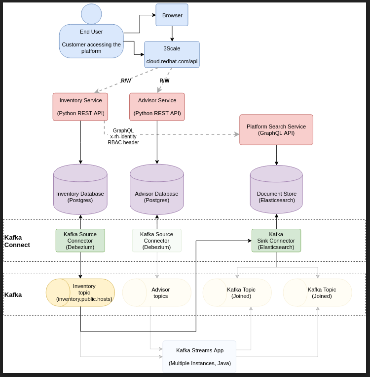

Cross Join is the name for the pipeline which synchronizes data between
application databases and Elasticsearch.

## Architecture

This describes the current state (Milestone 2) of Cross Join. This will
be updated when Milestone 3 is completed to describe the process of
joining data across applications.

[Debezium](https://debezium.io/documentation/) connects to the
application’s database via a replication slot. It sends all changes to
the database into a Kafka topic. The [Elasticsearch Kafka
Connector](https://docs.confluent.io/current/connect/kafka-connect-elasticsearch/index.html)
consumes the same topic and sends changes into an Elasticsearch index.
Back-end services then consume the Elasticsearch index via the [Cross
Join Query API
(GraphQL)](https://github.com/redhatinsights/xjoin-search)

## Cross Join Query API

This is a GraphQL API which is used by back-end applications to consume
an Elasticsearch index. It is another data source to be used alongside
an apps existing Postgres DB. The intended primary usage is to retrieve
lists of data (e.g. GET all RHEL7 hosts on an account). The Cross Join
Query API is read-only.

The query interface is only accessible from within the OpenShift cluster
i.e. it is not possible to use it e.g. from frontend applications
directly. A valid [x-rh-identity
header](https://docs.google.com/document/d/1PAzJqcUXlxg7t5cX1lsPsQtBPT_95bZbyB9Iiv_ekGM/edit)
is required for each query.

### Available queries

Currently data from Host Based Inventory can be queried using the query
interface.

Two types of queries are available:

  - [hosts](https://github.com/RedHatInsights/xjoin-search/blob/19e986a8ae26aa384ca407e468a35b94e151edb2/src/schema/schema.graphql#L254)
    which allows a list of hosts that match given criteria to be
    obtained

  - [hostTags](https://github.com/RedHatInsights/xjoin-search/blob/19e986a8ae26aa384ca407e468a35b94e151edb2/src/schema/schema.graphql#L270)
    which provides aggregated information on tags applied to hosts

Here is [documentation of the GraphQL
API.](https://github.com/RedHatInsights/xjoin-search/blob/master/docs/schema.md)
There is also a GraphQL playground which can be run locally by following
the instructions in the
[readme](https://github.com/RedHatInsights/xjoin-search#running-the-application)
.

These are the URLs to the API in each environment:

  - CI <http://xjoin-search.xjoin-ci.svc.cluster.local:4000/graphql>

  - QA <http://xjoin-search.xjoin-qa.svc.cluster.local:4000/graphql>

  - Stage
    <http://xjoin-search.xjoin-stage.svc.cluster.local:4000/graphql>

  - Prod <http://xjoin-search.xjoin-prod.svc.cluster.local:4000/graphql>

## Sending Data Into Cross Join

This is currently a WIP. This section will be updated with instructions
for developers when the xjoin-kstreams application is ready.

## Github Projects

Cross Join is composed of the following Github projects:

  - <https://github.com/RedHatInsights/xjoin-config>

  - <https://github.com/RedHatInsights/xjoin-kstreams>

  - <https://github.com/RedHatInsights/xjoin-search>

  - <https://github.com/RedHatInsights/xjoin-jenkins-lib>

  - <https://github.com/RedHatInsights/xjoin-kafka-connect>

## Questions

This document is a work in progress. Feel free to contact Chris Kyrouac
(Slack: ckyrouac, Email: [ckyrouac  @  redhat  .
 com](mailto:ckyrouac@redhat.com) ) with any questions.

